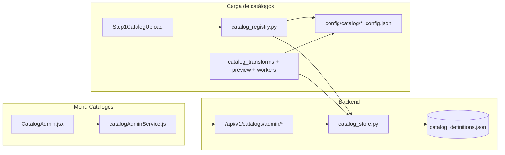
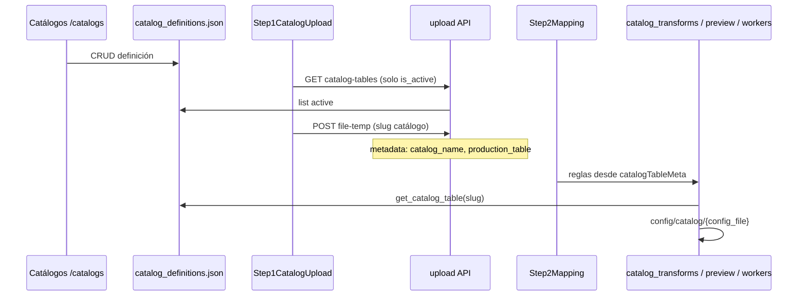

# Menú Catálogos — Lógica y arquitectura

Documentación del panel **Catálogos** (`/catalogs`) y su relación con el wizard de carga de catálogos (`/upload/catalog`).

---

## Visión general

El menú **Catálogos** es el **panel de administración** donde se define cómo se cargan datos maestros (SKUs, ubicaciones, etc.) hacia tablas de producción. No ejecuta cargas: **configura reglas** que luego consume el wizard en `/upload/catalog`.

---

## Acceso y pantalla

| Pieza | Ubicación | Rol |
|--------|-----------|-----|
| Enlace sidebar | `frontend/src/components/Sidebar.jsx` | **Catálogos** → `/catalogs` |
| Ruta | `frontend/src/App.jsx` | Renderiza `CatalogAdmin` |
| Página | `frontend/src/pages/CatalogAdmin.jsx` | UI principal |
| Servicio HTTP | `frontend/src/services/catalogAdminService.js` | Llamadas al API admin |

**Layout:** lista de catálogos a la izquierda + formulario con pestañas a la derecha.

**Al montar la página:**

1. Carga **todos** los catálogos (`GET /api/v1/catalogs/admin`, incluye inactivos).
2. Carga **esquemas** de BD (`GET /api/v1/system/schemas`) para los dropdowns de destino en la pestaña General.

---

## Persistencia: `catalog_store.py`

| Aspecto | Detalle |
|---------|---------|
| Archivo | `data/catalog_definitions.json` |
| Inicialización | Si no existe, se crea con semillas `skus` y `location` (`_BUILTIN_CATALOGS`) |
| Concurrencia | Lock en hilo para lecturas/escrituras seguras |
| Nombre | Slug normalizado: minúsculas, solo `a-z0-9_` |

### Campos de cada catálogo

| Campo | Uso |
|--------|-----|
| `name` | Identificador (slug); lo usa el wizard y el batch (`catalog_name`) |
| `label` | Texto visible en la UI |
| `target_schema` / `target_table` | Tabla física en PostgreSQL |
| `config_file` | JSON de validación en `config/catalog/` (ej. `skus_config.json`) |
| `is_active` | Si aparece en el wizard de carga |
| `required_columns` / `optional_columns` | Reglas de datos y panel de ayuda |
| `unique_keys` | Clave para UPSERT en promoción |
| `required_mapping_columns` | Obligatorias en el paso 2 del wizard (ej. `status` en SKUs) |
| `ignored_file_headers` | Columnas del archivo que no se muestran en el mapping |
| `non_mappable_targets` | Columnas destino que no aparecen en el dropdown |
| `column_aliases` | Reservado (no usado en auto-mapeo; el paso 2 solo enlaza si el nombre del Excel coincide exactamente con la columna de la tabla) |
| `enums` / `defaults` | Valores permitidos y relleno en transformación |
| `validation_hints` | Notas mostradas en el panel lateral del wizard |

### Operaciones de almacenamiento

- **Listar:** `list_all_catalogs(active_only=False|True)`
- **Obtener:** `get_catalog_by_name(name)`
- **Crear:** `create_catalog(payload)` — error si el slug ya existe
- **Actualizar:** `update_catalog(name, payload)`
- **Desactivar:** `delete_catalog(name, hard=False)` → `is_active: false`
- **Borrar:** `delete_catalog(name, hard=True)` → elimina del JSON

---

## API admin (`src/data_staging/api/routers/catalogs.py`)

Todas las rutas requieren usuario autenticado (`get_current_user`).

| Método | Ruta | Función |
|--------|------|---------|
| GET | `/api/v1/catalogs/admin` | Listar todos los catálogos |
| GET | `/api/v1/catalogs/admin/schema-columns?schema=&table=` | Columnas desde `information_schema` |
| GET | `/api/v1/catalogs/admin/{name}` | Obtener un catálogo |
| POST | `/api/v1/catalogs/admin` | Crear catálogo |
| PUT | `/api/v1/catalogs/admin/{name}` | Actualizar catálogo |
| DELETE | `/api/v1/catalogs/admin/{name}?hard=` | Desactivar o borrar |

> **Importante:** La ruta `/admin/schema-columns` debe registrarse **antes** de `/admin/{name}` en FastAPI. Si no, `schema-columns` se interpreta como un nombre de catálogo y devuelve *Catálogo no encontrado*.

El endpoint `schema-columns` consulta la base de datos real para el botón **Cargar columnas desde BD**: devuelve nombre, tipo, nullable y default de cada columna.

---

## Lógica del frontend (`CatalogAdmin.jsx`)

### Panel izquierdo

- Lista de catálogos con `label` y `target_schema.target_table`.
- Los inactivos se marcan visualmente (clase `inactive`).
- Clic en un ítem → `selectCatalog(name)` → `GET /admin/{name}` y rellena el formulario.

### Botón «+ Nuevo catálogo»

- Activa modo `isNew = true` y formulario vacío (`emptyCatalogForm()`).
- El **nombre (slug)** solo es editable al crear; tras guardar queda fijo.

### Pestañas del formulario

#### 1. General

- **Nombre (slug)** y **Etiqueta**.
- **Schema destino** y **Tabla destino** (dropdowns desde BD vía `getSchemas` / `getTables`).
- **Archivo config** — referencia a `config/catalog/{name}_config.json`.
- **Activo en wizard de carga** — controla visibilidad en `/upload/catalog`.
- **Cargar columnas desde BD** — muestra chips clicables para añadir columnas a listas (p. ej. opcionales).

#### 2. Columnas

- Columnas requeridas (datos).
- Columnas opcionales.
- Clave única (upsert).
- Notas de validación (solo UI / panel lateral del wizard).

#### 3. Mapping

- Obligatorias en paso 2 del wizard (`required_mapping_columns`).
- Cabeceras de archivo ignoradas (`ignored_file_headers`).
- Destinos no mapeables (`non_mappable_targets`).

#### 4. Avanzado

- **Aliases (JSON):** sinónimos de cabeceras de archivo por columna destino.
- **Enums (JSON):** valores permitidos por columna.
- **Defaults (JSON):** valores por defecto al transformar (solo en columnas mapeadas).

### Guardar (`handleSave`)

1. `buildPayload()` parsea JSON de aliases, enums y defaults.
2. Completa automáticamente:
   - `target_table` ← `name` si está vacío.
   - `config_file` ← `{name}_config.json` si está vacío.
3. `POST` (nuevo) o `PUT` (existente).
4. Recarga la lista y re-selecciona el catálogo guardado.

### Desactivar

- `DELETE` sin `hard` → el catálogo deja de aparecer en el wizard pero sigue visible en admin como inactivo.

---

## Conexión con la carga de catálogos

El menú Catálogos **no sube archivos**. El flujo de carga lo consume así:

### Paso 1 — `Step1CatalogUpload.jsx`

- `GET /api/v1/upload/catalog-tables` → `catalog_registry.list_catalog_tables()` → solo catálogos con `is_active: true`.
- El usuario elige un catálogo del desplegable (etiqueta + destino `schema.tabla`).
- Esquema y tabla física se toman de la definición; no se piden de nuevo en el wizard.
- Subida: `uploadFileTemp(file, target_schema, catalogSlug, null, 'catalog')`.

### Metadata del batch (upload)

| Campo | Contenido |
|--------|-----------|
| `target_table` | Slug del catálogo (`skus`, `location`) — preview y UPSERT |
| `catalog_name` | Igual al slug |
| `production_table` | Tabla física en BD (`skus`, `location`) |
| `target_schema` | Esquema físico (`public`, etc.) |
| `load_type` | `catalog` |

### Paso 2 — `Step2Mapping.jsx`

- Carga columnas de producción con `selectedSchema` + `selectedTable` (tabla física).
- Reglas desde `wizardData.catalogTableMeta` vía `frontend/src/utils/catalogMapping.js`:
  - `isIgnoredFileHeader`
  - `isSystemManagedTargetColumn`
  - `getCatalogRequiredMappingColumns`
- Al guardar mapping, en modo catálogo envía el **slug** en `target_table` y la tabla física en `production_table`.

### Preview y workers

- `catalog_preview_service.py` — `get_catalog_table(slug)` + `load_validation_rules()` desde `config/catalog/`.
- `catalog_transforms.py` — transforms, enums, defaults según definición del store.
- `file_processor.py` / `promotion_worker.py` — resuelven tabla física con `production_table` o `resolve_catalog_db_target()`; UPSERT usa el slug para las claves en `_CATALOG_UPSERT_KEYS`.

---

## Dos capas de configuración

| Capa | Ubicación | Qué controla |
|------|-----------|----------------|
| **Definición de catálogo** | `data/catalog_definitions.json` (editable desde UI) | Destino BD, reglas de mapping en UI, aliases, enums, defaults, hints |
| **Reglas de validación** | `config/catalog/{name}_config.json` | Reglas del `DataValidator` en preview y worker (tipos, rangos, etc.) |

Cambios en el admin (JSON del store) se reflejan de inmediato en wizard y transforms. Para validación estructurada nueva suele hacer falta crear o editar también el archivo en `config/catalog/`.

> El admin **no genera** automáticamente el `{name}_config.json`; solo guarda el nombre del archivo en `config_file`.

---

## Catálogos precargados

### `skus` — Productos (SKUs)

| Aspecto | Valor |
|---------|--------|
| Destino | `public.skus` |
| Clave única | `(organization_id, code)` |
| Ignorar en archivo | `sku_id`, `organization_id`, timestamps |
| No mapeable en destino | PK, auditoría, `organization_id` |
| Obligatorio en mapping | `status` |
| Enum | `status`: active, discontinued, new_launch |

`code` es el SKU de negocio; `sku_id` lo genera la BD.

### `location` — Ubicaciones

| Aspecto | Valor |
|---------|--------|
| Destino | `public.location` |
| Clave única | `(organization_id, location_code)` |
| Ignorar en archivo | `location_id`, `organization_id`, timestamps |
| Defaults | country, timezone, is_active |

`location_code` es el código de negocio; `location_id` lo genera la BD.

---

## Archivos clave

| Área | Archivos |
|------|----------|
| UI admin | `frontend/src/pages/CatalogAdmin.jsx`, `CatalogAdmin.css` |
| Servicio FE | `frontend/src/services/catalogAdminService.js` |
| Reglas mapping FE | `frontend/src/utils/catalogMapping.js` |
| API | `src/data_staging/api/routers/catalogs.py` |
| Persistencia | `src/data_staging/catalog/catalog_store.py`, `data/catalog_definitions.json` |
| Registry runtime | `src/data_staging/catalog/catalog_registry.py` |
| Transforms / preview | `catalog_transforms.py`, `services/catalog_preview_service.py` |
| Workers | `workers/file_processor.py`, `workers/promotion_worker.py` |
| Config validación | `config/catalog/skus_config.json`, `location_config.json` |
| Wizard carga | `Step1CatalogUpload.jsx`, `CatalogUploadWizard.jsx`, `Step2Mapping.jsx` |

---

## Flujo operativo resumido

1. En **Catálogos** (`/catalogs`) defines destino en BD, columnas, reglas de mapping y JSON avanzado.
2. Marcas **Activo en wizard de carga** para que aparezca en `/upload/catalog`.
3. (Opcional) Creas `config/catalog/{name}_config.json` para validación profunda.
4. En **Carga de catálogos**, el usuario elige el catálogo y sigue el wizard de 4 pasos.
5. Backend y workers leen la definición del store y el config de validación en cada etapa.

---

## Crear un catálogo nuevo (checklist)

1. **Catálogos** → Nuevo → slug, etiqueta, schema/tabla, activo.
2. Pestañas Columnas y Mapping según reglas de negocio.
3. Avanzado: aliases, enums, defaults si aplica.
4. Crear `config/catalog/{slug}_config.json` con `validation_rules` si necesitas validación del `DataValidator`.
5. Probar en `/upload/catalog` con un archivo de prueba.
