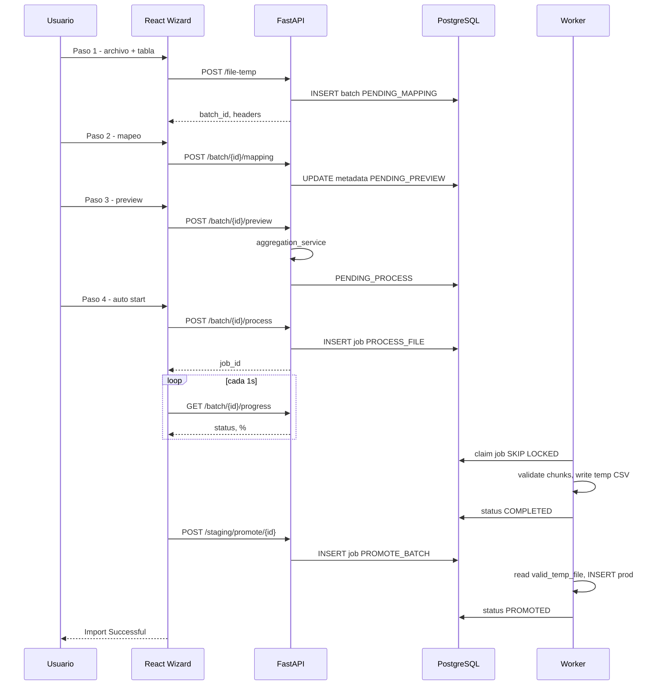
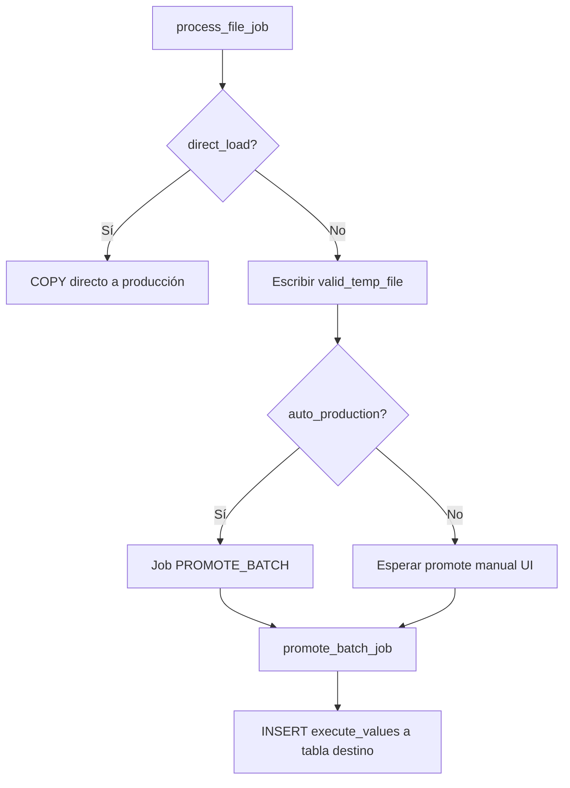

# Funcionamiento actual de la aplicación — Paso a paso

**Sistema:** M8 Connect v2.0  
**Fecha:** 27 de mayo de 2026  
**Propósito:** Describir con detalle cómo opera la aplicación hoy (código + UI), desde el arranque hasta la carga en producción.

---

## Tabla de contenidos

1. [Visión general](#1-visión-general)
2. [Arranque del sistema](#2-arranque-del-sistema)
3. [Arquitectura en tiempo de ejecución](#3-arquitectura-en-tiempo-de-ejecución)
4. [Flujo principal: Asistente de importación (Wizard)](#4-flujo-principal-asistente-de-importación-wizard)
5. [Flujo alternativo: Upload directo por API](#5-flujo-alternativo-upload-directo-por-api)
6. [Procesamiento en el worker (`PROCESS_FILE`)](#6-procesamiento-en-el-worker-process_file)
7. [Promoción a producción (`PROMOTE_BATCH`)](#7-promoción-a-producción-promote_batch)
8. [Estados del batch y del job](#8-estados-del-batch-y-del-job)
9. [Frontend: pantallas y navegación](#9-frontend-pantallas-y-navegación)
10. [Base de datos y artefactos en disco](#10-base-de-datos-y-artefactos-en-disco)
11. [Diagramas de flujo](#11-diagramas-de-flujo)
12. [Glosario](#12-glosario)

---

## 1. Visión general

La aplicación permite **importar archivos de datos** (CSV, Excel, JSON, Parquet) hacia tablas de una base de datos destino, pasando por:

1. **Carga y análisis** del archivo.
2. **Mapeo** de columnas archivo → tabla destino.
3. **Previsualización** y validación sobre una muestra (con agregación opcional Weekly/Monthly).
4. **Procesamiento masivo** en background (worker).
5. **Promoción** manual o automática a la tabla de producción.

El camino **recomendado y usado por la UI** es el **Wizard de 4 pasos** desde `/upload` (landing) → `/upload/history` o `/upload/catalog`. Existe **POST `/api/v1/upload/file`** para integraciones API directas. El flujo legacy con tablas `staging_data.stage_*` y router `/api/v1/staging/*` fue retirado; la validación escribe archivos temp en disco.

---

## 2. Arranque del sistema

### 2.1 Requisitos

- Python 3.10+ (README; `pyproject` admite 3.9).
- PostgreSQL 13+ **o** Supabase **o** ClickHouse (según `DATABASE_URL`).
- Node.js 18+ para el frontend.
- Archivo `.env` en `m8_connect/` con al menos `DATABASE_URL`.

### 2.2 Proceso 1 — API (`run_app.py`)

Secuencia al ejecutar `python run_app.py`:

1. **Logging** — Crea `logs/application.log`, `logs/sql.log`, `logs/errors.log`.
2. **Verificación `.env`** — Comprueba que exista y que `DATABASE_URL` no sea placeholder.
3. **Test de conexión** — `DatabaseManager.test_connection()`.
4. **Verificación de esquema** — Comprueba que exista `staging_meta.data_sources` (y columnas `created_at`, `updated_at`).
5. **Uvicorn** — Levanta `data_staging.api.main:app` en `0.0.0.0:8000`.

En el **lifespan** de FastAPI (`api/main.py`):

- Al iniciar: prueba conexión DB y registra routers (`upload`, `monitoring`, `system`, `auth`, `catalogs`).
- Al cerrar: log de shutdown.

### 2.3 Proceso 2 — Workers (`run_workers.py`)

1. Añade `src/` al `PYTHONPATH`.
2. Crea **1 worker** (`num_workers = 1`) por límites de pool en Supabase.
3. Instancia `PostgresQueueWorker` con:
   - `database_url` desde `settings.DATABASE_URL`
   - `poll_interval=5`
   - `use_notify=False` (LISTEN/NOTIFY desactivado con pooler)
4. Registra handlers:
   - `PROCESS_FILE` → `process_file_job`
   - `PROMOTE_BATCH` → `promote_batch_job`
5. Bucle infinito: polling cada 5 s, `FOR UPDATE SKIP LOCKED` para tomar jobs.

### 2.4 Proceso 3 — Frontend

```bash
cd frontend
npm install
npm run dev
```

- Proxy/API base configurado en `services/api.js` (típicamente `http://localhost:8000`).
- Rutas protegidas (JWT): `/login`, `/`, `/upload`, `/upload/history`, `/upload/catalog`, `/catalogs`, `/batches`, `/batches/:batchId`, `/monitoring`.

**Sin workers en ejecución**, los jobs quedan en `PENDING` y el wizard se queda en "Processing" sin avanzar.

---

## 3. Arquitectura en tiempo de ejecución

```
┌─────────────┐     HTTP      ┌──────────────────┐     SQL      ┌─────────────────┐
│  React UI   │ ────────────► │  FastAPI :8000   │ ───────────► │  PostgreSQL / │
│  (Vite)     │               │  upload, system  │              │  Supabase / CH  │
└─────────────┘               └────────┬─────────┘              └────────▲────────┘
                                       │ INSERT job                         │
                                       ▼                                    │
                              ┌──────────────────┐     poll / update        │
                              │  job_queue       │ ◄────────────────────────┘
                              │  (staging_meta)  │
                              └────────┬─────────┘
                                       │
                                       ▼
                              ┌──────────────────┐
                              │  run_workers.py  │
                              │  file_processor  │
                              │  promotion_worker│
                              └────────┬─────────┘
                                       │
                    ┌──────────────────┼──────────────────┐
                    ▼                  ▼                  ▼
            data/uploads/      data/temp/          Tabla producción
            (archivo original) (valid/rejected)   (ej. m8_schema.*)
```

---

## 4. Flujo principal: Asistente de importación (Wizard)

Ruta UI: **`/upload/history`** → `UploadWizard.jsx` (historia). **`/upload/catalog`** → `CatalogUploadWizard.jsx`. Landing en **`/upload`**.

### Paso 1 — Upload & Select Table (`Step1Upload.jsx`)

#### Acciones del usuario

1. Arrastra o selecciona archivo (`.csv`, `.xlsx`, etc.).
2. Elige **schema** y **tabla** destino (listados desde la API).
3. Opcionalmente elige **process type**: `Weekly`, `Monthly` u `Other`.
4. Pulsa continuar (Analyze / Upload).

#### Llamadas API

| Orden | Método | Endpoint | Servicio frontend |
|-------|--------|----------|-------------------|
| 1 | GET | `/api/v1/schemas` | `systemService.getSchemas` |
| 2 | GET | `/api/v1/tables?schema=...` | `systemService.getTables` |
| 3 | POST | `/api/v1/upload/file-temp` | `wizardService.uploadFileTemp` |

#### Qué hace el backend (`POST /file-temp`)

1. **Valida** extensión y nombre (`FileUploadService.validate_file`).
2. Genera **`batch_id`** (UUID).
3. **Guarda** el archivo en `UPLOAD_PATH` (por defecto `./data/uploads/`) con nombre:
   `{batch_id}_{timestamp}_{nombre_original}`.
4. **Analiza** estructura con Polars:
   - CSV: prueba encodings (`utf-8`, `latin-1`, `cp1252`), detecta delimitador (`,` o sniff).
   - Excel: hojas y columnas.
   - JSON: NDJSON o array.
5. Inserta fila en **`staging_meta.batch_control`**:
   - `status = 'PENDING_MAPPING'`
   - `source_name` = nombre de tabla destino (si se indicó) o stem del archivo
   - `metadata` JSON con:
     - `file_analysis` (columnas, tipos, muestra, delimiter, encoding)
     - `file_headers`
     - `file_path`
     - `target_schema`, `target_table`
     - `wizard_step: 1`

#### Respuesta al frontend

```json
{
  "batch_id": "...",
  "file_headers": ["col1", "col2"],
  "estimated_rows": 12345,
  "status": "pending_mapping"
}
```

El frontend guarda `batchId`, headers, schema, table en `wizardData` y avanza al **paso 2**.

---

### Paso 2 — Map Columns (`Step2Mapping.jsx`)

#### Acciones del usuario

1. Ve columnas del archivo vs columnas de la tabla destino (`GET /api/v1/system/table-columns`).
2. Asigna **mapeos** (origen → destino).
3. Define **valores por defecto** en columnas nuevas.
4. Activa/desactiva columnas con **toggles**.
5. Opcional: indica **columnas de deduplicación** (string separado por comas).
6. Guarda y continúa.

#### Llamada API

**POST** `/api/v1/upload/batch/{batch_id}/mapping`

Body esperado:

```json
{
  "target_schema": "m8_schema",
  "target_table": "products",
  "column_mappings": {
    "Nombre Producto": {
      "target": "product_name",
      "default_value": "",
      "auto_mapped": true
    }
  },
  "column_toggles": { "Nombre Producto": true, "Precio": true },
  "dedup_columns": "product_id",
  "process_type": "Weekly"
}
```

#### Qué hace el backend

1. Lee `batch_control.metadata` existente.
2. Fusiona mappings, toggles, dedup, `process_type`.
3. Actualiza `source_name` = `target_table` si aplica.
4. `status = 'PENDING_PREVIEW'`, `wizard_step: 2`.

---

### Paso 3 — Preview & Validate (`Step3Preview.jsx`)

#### Acciones del usuario

1. Solicita generar preview (automático al entrar o botón).
2. Revisa estadísticas y tabla de muestra.
3. Si hay errores de agregación, puede volver al paso 2.

#### Llamada API

**POST** `/api/v1/upload/batch/{batch_id}/preview`

#### Qué hace el backend

1. Lee metadata: `file_path`, `column_mappings`, `column_toggles`, `process_type`, `file_analysis`.
2. Invoca **`process_aggregation`** (`aggregation_service.py`):

   | process_type | Comportamiento |
   |--------------|----------------|
   | `Other` | Stats básicos; no transforma archivo |
   | `Weekly` | Agrupa por semana; requiere mapeo a `start_date`, `qty` (y opcional `total_price`) |
   | `Monthly` | Agrupa por mes; mismos requisitos |

3. Para Weekly/Monthly:
   - Lee CSV con Polars (solo columnas activas).
   - Renombra según mapping; inyecta columnas estáticas.
   - Limpia tipos (fechas, números con comas).
   - Agrupa y suma cantidades.
   - Escribe archivo agregado y guarda ruta en `metadata.aggregated_file_path`.

4. Actualiza batch: `status = 'PENDING_PROCESS'`, `wizard_step: 3`, `preview_generated: true`.

#### Respuesta

```json
{
  "batch_id": "...",
  "validation_summary": { "total_rows": 1000, "valid_rows": 950, ... },
  "preview_data": [ {...}, ... ],
  "target_schema": "m8_schema",
  "target_table": "products"
}
```

---

### Paso 4 — Process (y promoción) (`Step4Process.jsx`)

Este paso combina **procesamiento masivo** y, tras completar, **promoción opcional manual**.

#### 4.1 Inicio automático al montar el componente

Al cargar Step 4, `useEffect` llama a `handleStartProcessing()`:

**POST** `/api/v1/upload/batch/{batch_id}/process`

Body (desde frontend):

```json
{
  "auto_production": false
}
```

(`direct_load` puede enviarse desde otras integraciones; el wizard actual no lo activa por defecto.)

#### Qué hace el backend en `/process`

1. Verifica que el batch exista.
2. Fusiona en `metadata`:
   - `column_mappings`, `selected_columns`
   - `direct_load`, `auto_production`
3. `status = 'PENDING'`.
4. Resuelve `file_path`:
   - `metadata.aggregated_file_path` (si Weekly/Monthly) **o**
   - `metadata.file_path` **o**
   - fallback `settings.UPLOAD_PATH / {batch_id}_{file_name}` (**bug conocido:** usa `upload_path` minúsculas).
5. Consulta tipos de columnas destino (`information_schema` o `system.columns` en ClickHouse).
6. Si no hay job `PENDING`/`PROCESSING` para ese batch, crea job:

```python
create_job(
  database_url=...,
  job_type="PROCESS_FILE",
  payload={
    "batch_id": ...,
    "file_path": ...,
    "column_mappings": ...,
    "selected_columns": ...,
    "auto_production": False,
    "target_column_types": {...},
    "direct_load": False
  }
)
```

7. Responde `{ "message": "Processing queued", "job_id": "..." }`.

#### 4.2 Polling de progreso (frontend)

Cada **1 segundo**:

**GET** `/api/v1/upload/batch/{batch_id}/progress`

El backend lee `batch_control` y devuelve:

| Campo | Origen |
|-------|--------|
| `progress_percentage` | `metadata.processing_progress` (actualizado por worker) o heurística por `status` |
| `processed_rows` / `loaded_rows` | `records_count` |
| `rejected_rows` | `metadata.processing_stats.total_rejected` |
| `status` | `batch_control.status` |

Condiciones de fin en UI:

| status batch | Acción UI |
|--------------|-----------|
| `COMPLETED` | Muestra pantalla de éxito parcial; ofrece **Promote** |
| `PROMOTED` | Éxito total (si hubo auto_production) |
| `FAILED` | Pantalla de error |

#### 4.3 Promoción manual (botón "Promote to Production")

**POST** `/api/v1/upload/staging/promote/{batch_id}`

1. Valida `target_schema` y `target_table` en metadata.
2. Evita duplicar job `PROMOTE_BATCH` activo.
3. Crea job `PROMOTE_BATCH` con prioridad 10.

Frontend hace polling cada **2 s** hasta `status === 'PROMOTED'` o `FAILED`.

#### 4.4 Descarga de rechazados

**GET** `/api/v1/upload/staging/batch/{batch_id}/rejected/download`

- Lee `metadata.rejected_temp_file` del disco.
- Streaming TSV/CSV sin cargar todo en memoria.

#### 4.5 Reiniciar wizard

`deleteBatch` → **DELETE** `/api/v1/upload/batch/{batch_id}` (**actualmente roto** por falta de import).

---

## 5. Flujo alternativo: Upload directo por API

**POST** `/api/v1/upload/file`

Diferencias respecto al wizard:

| Aspecto | Wizard | Upload directo |
|---------|--------|----------------|
| Análisis previo | Sí (`file-temp`) | No |
| Mapeo | Pasos 2–3 | Debe enviarse después vía `/process` o metadata manual |
| Job inicial | No hasta `/process` | **Sí**, `PROCESS_FILE` inmediato al subir |
| Estado inicial | `PENDING_MAPPING` | `UPLOADED` |

Secuencia upload directo:

1. Valida y guarda archivo.
2. Inserta `batch_control` con `status = 'UPLOADED'`.
3. Crea job `PROCESS_FILE` con `file_path` y `source_name`.
4. Responde con `batch_id`, `job_id`, URL de status.

Para configurar mapeo en integraciones API, el cliente debe:

1. Actualizar metadata (no hay endpoint dedicado fuera del wizard excepto `/mapping`).
2. Llamar **POST** `/batch/{id}/process` con `ProcessRequest` (`column_mapping`, `direct_load`, `auto_production`).

---

## 6. Procesamiento en el worker (`PROCESS_FILE`)

Handler: **`process_file_job`** en `file_processor.py`.

### 6.1 Entrada

Payload mínimo:

```json
{
  "batch_id": "uuid",
  "file_path": "/ruta/archivo.csv"
}
```

Configuración efectiva (prioridad):

1. Campos del **payload** del job.
2. Si faltan → **`batch_control.metadata`**.

Incluye: `column_mappings`, `column_toggles`, `selected_columns`, `target_schema`, `target_table`, `dedup_columns`, `direct_load`, `auto_production`, `target_column_types`.

### 6.2 Fase A — Preparación

1. Conecta a PostgreSQL con `psycopg2` (no usa pool SQLAlchemy del worker).
2. Lee batch; falla si no existe.
3. `status = 'PROCESSING'`, `started_at = now()`.
4. Busca `job_id` asociado en `job_queue` (para progreso).
5. Crea rutas en `TEMP_PATH`:
   - `{batch_id}_valid_records.parquet`
   - `{batch_id}_rejected_records.csv`
6. Persiste rutas en `metadata` del batch.
7. Si faltan tipos de columna, consulta `information_schema.columns`.
8. Carga **FK** permitidos: por cada FK de la tabla destino, hace `SELECT DISTINCT` en tabla referenciada y guarda set en memoria.

### 6.3 Fase B — Lectura y chunks

Constantes:

- `CHUNK_SIZE_RECORDS = 1_000_000`
- `BATCH_SIZE_INSERT = 50_000` (legacy inserts a staging)

Para **CSV**:

1. `pl.read_csv` **archivo completo** (con `infer_schema_length=0` → todo string).
2. Itera slices de hasta 1M filas.
3. Por cada slice → `process_single_chunk`.

Para **Excel**: lee workbook completo, mismo troceo.

### 6.4 Fase C — Por cada chunk (`process_single_chunk`)

1. **`validate_and_prepare_chunk`**:
   - Filtra `selected_columns`.
   - Aplica `column_mapping` (defaults tienen prioridad sobre source).
   - Por cada fila: valida tipos, NOT NULL, FK, caracteres de control.
   - Genera registros con `validation_status` PASSED/FAILED, `processed_data` JSON, `error_details`.

2. **Salida según modo**:

   | Modo | PASSED | FAILED |
   |------|--------|--------|
   | `direct_load=true` | `COPY` a `{target_schema}.{target_table}` vía `DirectIngestor` | Archivo rejected |
   | Modo estándar (wizard) | Append TSV a `valid_temp_file` | Append TSV a `rejected_temp_file` |
   | Legacy staging BD | `insert_records_in_batches` (poco usado en flujo actual) | idem |

3. Actualiza progreso en `metadata.processing_progress` del batch.

### 6.5 Fase D — Cierre

1. Si `total_inserted > 0` → `status = 'COMPLETED'`, si no → `FAILED`.
2. Guarda `processing_stats` en metadata (`total_inserted`, `total_rejected`, chunks, avg quality).
3. Si `auto_production=true` → encola job `PROMOTE_BATCH` con prioridad 10.

### 6.6 Formato archivo válido temporal

Primera línea (header): columnas destino + `_batch_id_` + `_source_row_number_` (en modo estándar).

Filas: valores separados por **tab**, NULL como `\N`.

Este archivo es el insumo de **`promote_batch_job`**.

---

## 7. Promoción a producción (`PROMOTE_BATCH`)

Handler: **`promote_batch_job`** en `promotion_worker.py`.

### 7.1 Entrada

```json
{
  "batch_id": "uuid",
  "target_schema": "m8_schema",
  "target_table": "products",
  "dedup_columns": "id,name"   // opcional; hoy no se aplica check previo
}
```

### 7.2 Pre-validación dedup

Si hay `dedup_columns` en metadata, el worker **solo registra en log** que la verificación se omite por rendimiento. No ejecuta pre-check de duplicados en staging.

### 7.3 Inserción

1. Lee `metadata.valid_temp_file`.
2. Si no existe → **error crítico** (el flujo actual depende del archivo, no de `staging_data.stage_*`).
3. Abre archivo; lee header TSV.
4. Cruza columnas del archivo con columnas reales en BD (case-insensitive).
5. Si existe columna `imported_at` en destino, añade `NOW()` en insert.
6. Lee línea a línea; acumula chunks de **50 000** filas (`PROMOTION_BATCH_SIZE`).
7. Inserta con `psycopg2.extras.execute_values`.
   - Para **historia** y **catálogos**, si hay índice único compatible en BD, usa `INSERT ... ON CONFLICT ... DO UPDATE` (ver [§7.4](#74-upsert--historia-publicsales_history)).
8. Tras cada chunk: **commit** y actualiza `metadata.promoted_rows` (reanudación).
9. Si crash DB → `status = 'PARTIALLY_PROMOTED'` vía conexión de rescate.

### 7.4 UPSERT — Historia (`public.sales_history`)

Cuando `load_type` es `history` o el destino es `public.sales_history`, la promoción intenta un UPSERT si existe un índice único en PostgreSQL que coincida con las claves configuradas (`history_config.HISTORY_UNIQUE_KEYS` → `history_schema.pick_history_conflict_columns`).

**Clave de conflicto** — define si el registro **ya existe** (actualizar) o es **nuevo** (insertar):

| Columna | Rol |
|---------|-----|
| `organization_id` | Organización |
| `location_code` | Tienda / ubicación |
| `sku` | Código de producto |
| `period_start` | Inicio del periodo |
| `granularity` | Granularidad (p. ej. `week`, `month`) |

> `sku_id` **no** forma parte de la clave ni del modelo actual de `sales_history`. El producto se identifica por la columna `sku` (código de negocio).

**Columnas que se sobrescriben al actualizar** — en conflicto, el worker genera `DO UPDATE SET` con todas las columnas del INSERT **excepto** la clave de conflicto e `id`:

| Columna | Comportamiento en conflicto |
|---------|----------------------------|
| `quantity` | **Se actualiza** con el valor del archivo nuevo |
| `pieces` | **Se actualiza** |
| `source` | **Se actualiza** (extensión del archivo) |
| `sales_channel` | **Se actualiza** (valor fijo `SELL_IN` en wizard) |
| `imported_at` | **Se actualiza** a `NOW()` si la columna existe en BD |

Los contadores `promoted_inserted` / `promoted_updated` en metadata se calculan con `RETURNING (xmax = 0)` tras cada chunk.

**Requisito en BD:** el índice único de `public.sales_history` debe incluir exactamente las cinco columnas de la tabla anterior. Si no hay índice compatible, la promoción hace INSERT simple y puede registrar un warning en logs.

### 7.5 Reanudación

**POST** `/api/v1/upload/staging/promote/{batch_id}/resume`

- Solo si status es `PARTIALLY_PROMOTED` o `FAILED`.
- Nuevo job `PROMOTE_BATCH`; worker intenta saltar filas ya promovidas según `promoted_rows` en metadata.

### 7.6 Baseline de regresión (batch golden)

Batch de referencia: `7cd1ffb6-71a7-48e2-80c1-f38d25667342` (509 transacciones → 143 filas agregadas).

| Artefacto | Ruta |
|-----------|------|
| Fixtures | `tests/fixtures/batches/7cd1ffb6/` |
| Snapshot | `expected.json` (generado con `scripts/capture_batch_baseline.py`) |
| Tests | `pytest tests/test_batch_golden_*.py tests/test_validation_parity.py` |

Checklist post-cambios (Fase 0): claves UPSERT sin `sku_id`, `quantity`/`pieces` se actualizan en conflicto, promoción solo columnas del Parquet, agregación 509→143 con checksum estable.

### 7.7 Rendimiento (>20M filas)

| Setting | Default | Uso |
|---------|---------|-----|
| `PROCESS_CHUNK_SIZE` | 250_000 | Chunks en `PROCESS_FILE` |
| `AGGREGATION_CHUNK_SIZE` | 500_000 | Map-reduce en paso 3 |
| `PARQUET_COMPRESSION` | snappy | Upload / valid / agregado |
| `USE_VECTORIZED_VALIDATION` | false | Paridad vs legacy antes de activar |
| `PROGRESS_COMMIT_EVERY_CHUNKS` | 1 | Throttling progreso en BD |

RAM recomendada: 16 GB (20M crudo); espacio en `TEMP_PATH` ≈ 2× tamaño del archivo.

### 7.8 Finalización

1. Borra `valid_temp_file` del disco.
2. Intenta `DELETE` en `staging_data.stage_{source}` para el batch (limpieza legacy).
3. `status = 'PROMOTED'`, metadata con `promoted_count`.
4. Si `total_inserted == 0` → `PROMOTED` con mensaje de que no había registros.

---

## 8. Estados del batch y del job

### 8.1 Estados en `batch_control.status` (uso real en código)

| Estado | Significado típico |
|--------|-------------------|
| `PENDING_MAPPING` | Archivo subido; falta mapeo |
| `PENDING_PREVIEW` | Mapeo guardado; falta preview |
| `PENDING_PROCESS` | Preview listo; usuario debe iniciar process |
| `PENDING` | Encolado para worker |
| `UPLOADED` | Upload directo sin wizard |
| `PROCESSING` | Worker procesando archivo |
| `COMPLETED` | Validación/escritura a temp OK |
| `FAILED` | Error en process o promote |
| `PARTIALLY_PROMOTED` | Promoción interrumpida a mitad |
| `PROMOTED` | Datos en tabla producción |

> El enum SQLAlchemy `BatchStatus` en modelos **no lista todos** estos valores; la API usa strings libres en SQL.

### 8.2 Estados en `job_queue.status`

`PENDING` → `PROCESSING` → `COMPLETED` o `FAILED` (con reintentos hasta `max_retries`).

---

## 9. Frontend: pantallas y navegación

| Ruta | Componente | Función |
|------|------------|---------|
| `/login` | `Login.jsx` | Autenticación JWT |
| `/` | `Dashboard.jsx` | Resumen |
| `/upload` | `UploadLanding.jsx` | Elegir Historia o Catálogos |
| `/upload/history` | `UploadWizard.jsx` | Wizard historia (4 pasos) |
| `/upload/catalog` | `CatalogUploadWizard.jsx` | Wizard catálogos |
| `/catalogs` | `CatalogAdmin.jsx` | Admin catálogos |
| `/batches` | `Batches.jsx` | Historial de cargas |
| `/batches/:batchId` | `BatchProgress.jsx` | Detalle de batch |
| `/monitoring` | `Monitoring.jsx` | Estado del sistema |

### Servicios API (`frontend/src/services/`)

| Archivo | Responsabilidad |
|---------|-----------------|
| `api.js` | Cliente HTTP base (axios) |
| `authService.js` | Login y token |
| `wizardService.js` | file-temp, mapping, preview, process, progress, promote, download rejected |
| `systemService.js` | schemas, tables, columns (`/api/v1/system/*`) |
| `catalogAdminService.js` | Admin catálogos |
| `monitoringService.js` | Health y métricas |

---

## 10. Base de datos y artefactos en disco

### 10.1 Tabla `staging_meta.batch_control`

Campos usados intensivamente:

- `batch_id` (UUID PK)
- `source_name`, `source_type`, `file_name`, `file_size`
- `records_count` — filas válidas procesadas
- `status` — ver sección 8
- `metadata` (JSONB) — configuración wizard, rutas temp, progreso, stats
- `error_message`
- timestamps: `created_at`, `started_at`, `completed_at`

### 10.2 Tabla `staging_meta.job_queue`

Ver migración Alembic `002_job_queue_and_indexes`. Trigger `pg_notify` en INSERT (workers con `use_notify=False` no lo usan actualmente).

### 10.3 Archivos en disco

| Ruta | Contenido |
|------|-----------|
| `{UPLOAD_PATH}/{batch_id}_{ts}_{filename}` | Original subido |
| `{TEMP_PATH}/{batch_id}_valid_records.parquet` | Filas PASSED |
| `{TEMP_PATH}/{batch_id}_rejected_records.tsv` | Filas FAILED (export) |
| `metadata.aggregated_file_path` | CSV/Parquet agregado Weekly/Monthly |

### 10.4 Tablas staging en BD (legacy — retirado)

El worker ya **no** inserta en `staging_data.stage_*`. La promoción lee `{batch_id}_valid_records.parquet` desde `TEMP_PATH`.

---

## 11. Diagramas de flujo

### 11.1 Wizard completo (happy path)



### 11.2 Decisión de ruta de datos en worker



---

## 12. Glosario

| Término | Definición |
|---------|------------|
| **Batch** | Una carga de datos identificada por `batch_id` |
| **Job** | Tarea en cola (`PROCESS_FILE` o `PROMOTE_BATCH`) |
| **Wizard** | UI de 4 pasos en `/upload/history` o `/upload/catalog` |
| **Staging (concepto)** | Área intermedia de validación; hoy implementada como **archivos temp**, no solo tablas `staging_data` |
| **Promoción** | Paso final que inserta registros válidos en la tabla productiva |
| **PASSED / FAILED** | Resultado de validación por fila |
| **direct_load** | Omite archivo intermedio; COPY directo a producción durante process |
| **auto_production** | Encola promoción automática al terminar process |
| **dedup_columns** | Columnas clave para deduplicación (lógica de pre-check desactivada; puede aplicar constraint DB) |
| **source_name** | Identificador lógico; en wizard suele coincidir con nombre de tabla destino |

---

## Referencias en el repositorio

| Documento | Relación |
|-----------|----------|
| `README.md` | Instalación y comandos |
| `MANUAL_DE_USO.md` | Guía usuario (parcialmente desactualizada vs código) |
| `system_import_flow_guide.md` | Flujo antiguo basado en staging BD |
| `docs/ANALISIS_CODIGO.md` | Hallazgos técnicos y bugs |

---

*Este documento describe el comportamiento observado en el código en la rama MVP2. Ante divergencias con manuales antiguos, prevalece la implementación descrita aquí.*
